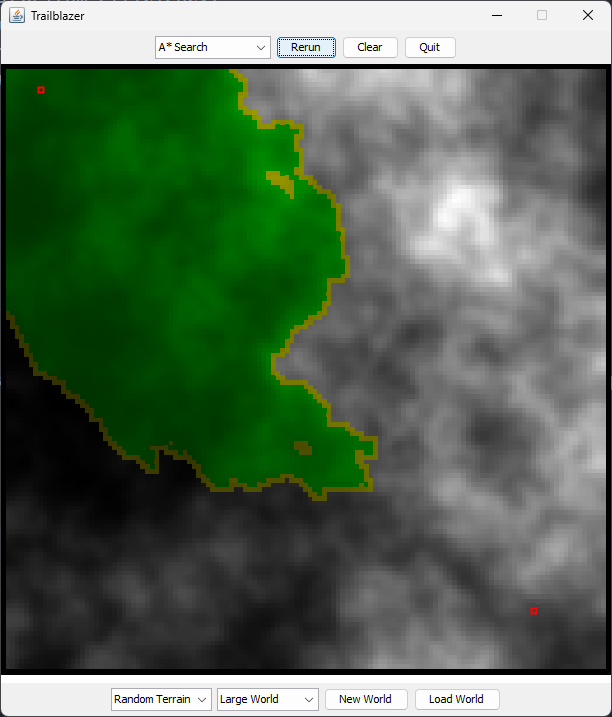

# Trailblazer: Advanced Pathfinding & Maze Generation

A comprehensive C++ implementation of fundamental graph algorithms including Dijkstra's algorithm, A* search, and Kruskal's algorithm for pathfinding and maze generation. This project provides an interactive visualization platform for exploring how these algorithms work in practice.

## Overview

This project implements three core algorithms that are fundamental to computer science and have wide applications in robotics, game development, network routing, and artificial intelligence:

- **Dijkstra's Algorithm**: For finding shortest paths in weighted graphs
- **A\* Search**: An enhanced pathfinding algorithm using heuristics for optimal performance
- **Kruskal's Algorithm**: For generating minimum spanning trees and creating mazes

## Algorithm Implementations

### Dijkstra's Algorithm

Dijkstra's algorithm finds the shortest path between nodes in a weighted graph. Our implementation uses a priority queue to efficiently explore nodes in order of their distance from the start.

**Key Features:**
- Guarantees optimal shortest path
- Works with positive edge weights
- Uses graph coloring for visualization (Gray → Yellow → Green)
- Time complexity: O((V + E) log V)
    - `V` represents the number of vertices (nodes) in the graph.
    - `E` represents the number of edges (connections) between nodes.

**How it works:**
1. Initialize all nodes with infinite distance except the start node (distance 0)
2. Use a priority queue to process nodes in order of shortest distance
3. For each node, update distances to its neighbors if a shorter path is found
4. Mark processed nodes as visited
5. Continue until the destination is reached

### A* Search Algorithm

A* enhances Dijkstra's algorithm by incorporating a heuristic function that estimates the cost to reach the goal. This makes it much more efficient for pathfinding scenarios.

**Key Features:**
- Optimal pathfinding with admissible heuristics
- Significantly faster than Dijkstra's for many scenarios
- Uses f(n) = g(n) + h(n) where g(n) is actual cost and h(n) is heuristic
- Ideal for navigation and game AI

**Implementation Details:**
- Combines actual distance with heuristic estimate
- Uses the same priority queue structure as Dijkstra's
- Supports various heuristic functions (Euclidean, Manhattan distance)
- Early termination when goal is reached

### Kruskal's Algorithm

Kruskal's algorithm creates minimum spanning trees by selecting edges in order of increasing weight, ensuring no cycles are formed.

**Key Features:**
- Generates random mazes using minimum spanning tree principles
- Uses Union-Find (Disjoint Set) data structure for cycle detection
- Creates mazes with guaranteed single path between any two points
- Time complexity: O(E log E)
    - `E` represents the number of edges in the graph.

**Maze Generation Process:**
1. Create all possible edges between adjacent cells
2. Assign random weights to edges
3. Sort edges by weight and process in order
4. Add edge to maze if it doesn't create a cycle
5. Use Union-Find to efficiently detect cycles

## Repository Structure

```
Pathfinding/
├── README.md                           # Project documentation
├── 260 Assignment 7.pdf               # Assignment specifications
└── Trailblazer/                       # Main project directory
    ├── Trailblazer.sln               # Visual Studio solution file
    ├── StanfordCPPLib-vs2022/        # Stanford C++ library
    │   ├── include/                   # Header files for data structures
    │   │   ├── grid.h                # 2D grid implementation
    │   │   ├── map.h                 # Hash map implementation
    │   │   ├── set.h                 # Set data structure
    │   │   ├── vector.h              # Dynamic array
    │   │   ├── pqueue.h              # Priority queue
    │   │   └── ...                   # Other utility headers
    │   ├── x64/                      # 64-bit compiled library
    │   └── x86/                      # 32-bit compiled library
    └── Trailblazer/                  # Core implementation
        ├── Trailblazer.cpp           # Main algorithm implementations
        ├── Trailblazer.h             # Function declarations
        ├── TrailblazerTypes.h        # Core data structures (Loc, Edge, Color)
        ├── TrailblazerTypes.cpp      # Type implementations
        ├── TrailblazerGraphics.h     # Visualization functions
        ├── TrailblazerGraphics.cpp   # Graphics implementation
        ├── TrailblazerPQueue.h       # Priority queue for algorithms
        ├── TrailblazerCosts.h        # Cost function definitions
        ├── TrailblazerCosts.cpp      # Cost calculations
        ├── WorldGenerator.h          # World/terrain generation
        ├── WorldGenerator.cpp        # World generation implementation
        ├── maze0-39                  # Predefined maze files for testing
        ├── terrain0-39               # Terrain files for pathfinding
        ├── TrailblazerDemo.exe       # Executable demo application
        └── Project files (.vcxproj, .filters, etc.)
```

### Core Files Description

- **`Trailblazer.cpp/h`**: Contains the main implementations of Dijkstra's, A*, and Kruskal's algorithms
- **`TrailblazerTypes.h`**: Defines fundamental data structures like `Loc` (location), `Edge`, and `Color` enums
- **`TrailblazerGraphics.cpp/h`**: Handles visualization and user interface for algorithm demonstration
- **`TrailblazerPQueue.h`**: Specialized priority queue optimized for pathfinding algorithms
- **`TrailblazerCosts.cpp/h`**: Implements various cost functions for different terrain types

## Applications

### 1. Navigation Systems
- **GPS and Mapping**: Route planning in navigation apps like Google Maps
- **Autonomous Vehicles**: Path planning for self-driving cars
- **Robotics**: Robot navigation in known environments

### 2. Game Development
- **NPC Pathfinding**: AI character movement in video games
- **Real-time Strategy**: Unit movement optimization
- **Procedural Content**: Random maze and dungeon generation

### 3. Network Optimization
- **Internet Routing**: Finding optimal paths for data packets
- **Telecommunications**: Network topology optimization
- **Supply Chain**: Logistics and delivery route optimization

### 4. Computer Graphics
- **Animation**: Character movement along optimal paths
- **Simulation**: Crowd simulation and movement patterns
- **Virtual Environments**: Navigation mesh generation

## Visual Demonstrations

#### Dijkstra's Algorithm Visualization
<div style="display: flex; gap: 10px;">
    
    
    
    
</div>

#### A* Search Visualization  
<div style="display: flex; gap: 10px;">
    
    
    
    
</div>

### Performance Metrics

| Algorithm   | Path Weight | Execution Time |
|-------------|-------------|---------------|
| Dijkstra    | 256.229     | 21.5 s        |
| A* Search   | 256.229     | 9.7 s         |

### Maze Generation Results


## Building and Running

### Prerequisites
- Visual Studio 2022 or later
- Windows operating system
- Stanford C++ Library (included)

### Build Instructions
1. Open `Trailblazer.sln` in Visual Studio
2. Set the build configuration to Debug or Release
3. Build the solution (Ctrl+Shift+B)
4. Run the executable from `x64/Debug/Trailblazer.exe`

### Usage
1. Launch the application
2. Select algorithm type (Dijkstra, A*, or Maze Generation)
3. Choose or generate a world/maze
4. Set start and end points
5. Watch the algorithm execute with real-time visualization

## Technical Details

### Data Structures Used
- **Priority Queue**: For efficient node processing in pathfinding
- **Grid**: 2D array representation of the world/maze
- **Map**: Hash map for storing distances and parent relationships
- **Set**: For storing edges in maze generation
- **Union-Find**: Disjoint set for cycle detection in Kruskal's algorithm

### Algorithm Optimizations
- **Decreasekey Operation**: Efficient priority queue updates in A*
- **Path Compression**: Union-Find optimization for faster cycle detection
- **Early Termination**: Stop search when destination is reached
- **Memory Management**: Efficient use of data structures for large grids

## Performance Analysis

The implementation provides insights into algorithm efficiency:
- **Dijkstra's**: Explores more nodes but guarantees optimal path
- **A***: Faster execution with good heuristics, maintains optimality
- **Kruskal's**: Efficient maze generation with random, solvable layouts

## Educational Value

This project demonstrates:
- Graph algorithm implementation in C++
- Priority queue usage and optimization
- Union-Find data structure applications
- Algorithm visualization techniques
- Performance analysis and comparison

Perfect for students learning algorithms, data structures, and their practical applications in computer science.
